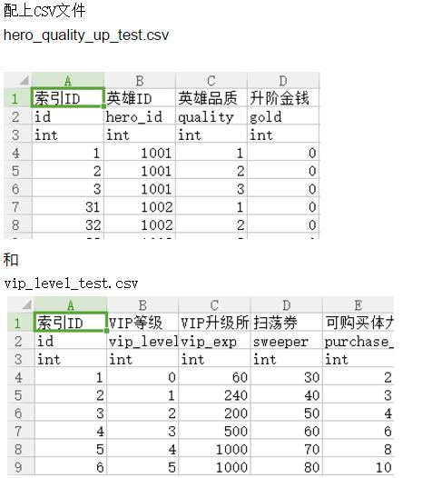

### CSVGenCode
```
Auto generate code by CSV config with user-defined the templete codes
now support gen the c++ code 
you can generate any kind program language by simple modify the templet files
for more details please see the example
hope that will help you 
```
##### 一。使用方式：
```
　　　1.将CSV文件拷贝到 ./Input 中格式参考下面
　　　2.双击CSVGenCode.sln 运行即可生成最终的可运行文件 ./Bin/CSVGenCode.exe
　　　3.运行Run.bat生成最终的代码  默认在./Config/Cpp/Output中 是C++代码
more:
      4.观看范例可以打开./Test/CSVGenCode_Cpp/CSVGenCode_Cpp.sln 项目
      	该范例是用于测试C++代码的正确性
      5.更多的拓展可以参考 -->四。修改模版
```
```
可以指定生成代码的参数
如：Run.bat中使用的参数为
```
```cpp
CSVCodeGen.exe -i=../Input -o=../Config/Cpp/Output -t=../Config/Cpp/Templet -r=../Config/Cpp/KeywordMapRule.txt 
```
##### 二。CSV格式
```
　　　第一行为注释
　　　第二行为生成的代码中的属性名字
　　　第三行为生成的代码中的类型
　　　剩下的4~$ 为内容
```
##### 三。目录说明
```
　　　 Input 中所有的csv文件作为输入
	   在Config目录中可以自动生成相应的结果
　　　 ./Config/Cpp/Templet 中所有文件作为模版文件
　　　 ./Config/Cpp/Output 为生成的代码
　　　 ./Config/Cpp/KeywordMapRule.txt 作为配置生成的代码的调整配置 具体使用可以查看该文 件内容
```
##### 三。CSVGenCode.exe参数说明
```
-i      Input directory which contained csv files
-o      Output directory which contained Generated Code
-t      Templet directory which contained code templet
-r      Rule file for generate code
-h      show command info
-help   sameAs the -h
```
##### 四。修改模版
如果生成的代码不合心意　可以修改./Config/Cpp/Templet中的文件
###### 其中可以使用的关键字如下
```
#RawFileName         		//原始文件名字   
#FileName         			//文件名字 大驼峰法           
#KeyTypeName      			//CSV主键类型   
#KeyType2FuncName       	//CSV中主键属性到方法的映射 参考Type2FuncNameMap        
#KeyName          			//CSV主键名字
#StructName       			//结构体名字
#ClsName          			//类名
#AttriName        			//CSV中属性的名字         
#AttriTypeName            	//CSV中属性的类型 
#AttriCommment            	//CSV中属性的注释   
#AttriType2FuncName       	//CSV中属性到方法的映射 参考Type2FuncNameMap
#KeyTypeColIdx       		//主键下标 默认为第一列 在attrTypeName中以字符 ‘#’ 开头的作为主键
```
###### 这些宏可以替换成最终的CSV中的内容
```
1. 类 宏标志(一个文件模版中可以有多个)
    #Begin_Replace_Tag_Class
    #End_Replace_Tag_Class
    在这个范围内的所有代码都将作为模版
    将遍历所有的CSV,并将每一个CSV作为一个单位进行替换
2. 属性 宏标志(一个类宏中可以有多个)
    #Begin_Replace_Tag_Attri
    #End_Replace_Tag_Attri
    在这个范围内的所有代码都将作为模版
    将遍历单个CSV的所有列,并将每一列作为一个单位进行替换
```
如:
```cpp
#Begin_Replace_Tag_Class
struct #StructName
{
#Begin_Replace_Tag_Attri
	//#AttriCommment
	#AttriTypeName		#AttriName;
#End_Replace_Tag_Attri
};
#End_Replace_Tag_Class
```

最终生成的代码为
```cpp
struct SHeroQualityUpTest
{
	//索引ID
	int		id;
	//英雄ID
	int		hero_id;
	//英雄品质
	int		quality;
	//升阶金钱
	int		gold;

};
struct SVipLevelTest
{
	//索引ID
	int		id;
	//VIP等级
	int		vip_level;
	//VIP升级所需经验
	int		vip_exp;
	//扫荡券
	int		sweeper;
	//可购买体力次数
	int		purchase_energy_count;
};
```


 
